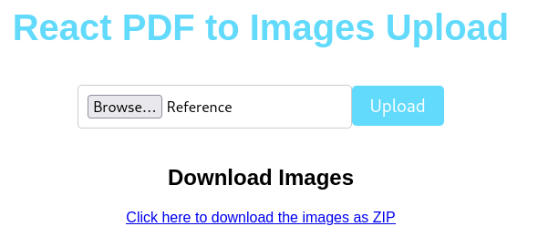

## Extract images from PDFs without quaility loss, powered by React and Golang

<p align="center">
  
</p>

# Set-Up 


## Requirements
Node.js and npm

## Execution
Run backend
```bash
cd backend
node server.js
```
Run backend
```bash
cd frontend
npm start
```

# Fast Test:

Choose Reference.pdf in ./Image-Extractor/backend and extract PDF

Image should be in path ./Image-Extractor/backend/Go-app/pdfs/images


